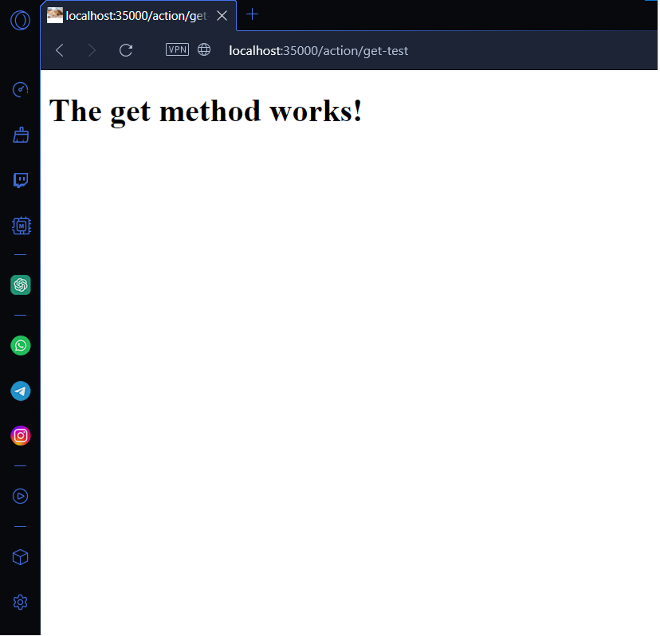

# MINI SPARK FRAMEWORK (TALLER 3 AREP)

Taller 3 del curso de Arquitecturas Empresariales (AREP) en el que se implementa un framework basado en funciones lambda el cual permite a los desarrolladores implementar servidores HTTP sencillos capaces de leer e interpretar peticiones GET y POST junto a funcionalidades de personalización para la interpretación de estos mensajes.

## Diseño
Este proyecto funciona y esta organizado en diferentes componentes con responsabilidades unicas.

1. `HTTPResponse` Componente clave encargado de formar, mapear y retornar los diferentes encabezados, códigos de respuesta y contenido del cuerpo de los mensajes HTTP. Se trata de una clase auxiliar.
2. `HTTPServer` componente principal del proyecto encargado de administrar el servicio HTTP y de atender las solicitudes de conexión de los clientes. Además, administra un sistema API que consume el front.
3. `Function` Interfaz encargada de mapear las diferentes funciones lambda personalizables que definan los desarrolladores, se utiliza como intermediaria para que el framework procese funciones de manera universal.
4. `Services` Componente principal en el cual el desarrollador define cuales funciones desea implementar para su servidor HTTP mediante el uso de métodos GET y POST e implementación comoda de funciones lambda que atiendan las solicitudes.
5. `Frontend` No se cuenta con un front definido, más sin embargo existen respuestas de funcionalidad de los servicios que pueden ser personalizados por el desarrollador.

## Extensión e implementación de otros servicios

Aún existen algunas funcionalidades a tener en cuenta para futuras versiones de este proyecto:

1. El componente encargado de generar encabezados puede extenderse para agregar aún más códigos de respuesta a diferencia de los que se encuentran actualmente (200 y 404) esto con el fin de cubrir todos los espectros de prueba que el usuario pueda generar.

2. El factor de lectura y envio de datos del servidor es perfectamente funcional, la página web podría aprovechar esta ventaja para implementar aún más recursos multimedia, tal como video y demás elementos audiovisuales.

3. Podría implementarse un servicio de subida de imagenes para alimentar la galeria con más datos ofreciendo más posibilidades de consumo dentro del proyecto.

4. Existen aún más métodos aparte de GET y POST, el framework podría extenderse para ofrecer un mayor espectro de servicios Web con los que los desarrolladores podrían crear soluciones de una forma más comoda y eficiente.

5. El servicio POST podría implementar la capacidad de archivos al servidor, funcionalidad que esta limitada a contenido en texto plano.

## Instrucciones de uso

### Pre-requisitos

Antes de ejecutar el servidor es necesario contar con los siguientes programas instalados y funcionando:

1. JDK (Java Development Kit)
2. MVN (Maven)

### Instalación y Ejecución

A continuación se muestra el paso a paso de como instalar y ejecutar el servidor HTTP

1. Clone este repositorio localmente en un entorno o carpeta de trabajo.

```
$ git clone https://github.com/NickArB/AREP-TALLER-3.git
```

2. Dentro del entorno o directorio en el que clono el proyecto, asegurese de que no existan ejecutables previos o no deseados con maven.

```
$ mvn clean
```
3. Una vez que los targets han sido descartados compilelos y re asignelos al target.
```
$ mvn package
```
4. Con los target asignados, ejecute el metodo main de la clase `Services.java`. Dependiendo de su IDE esta clase se puede ejecutar de varias formas, en caso de no tener un IDE se recomienda el uso del siguiente comando
```
$ java '-XX:+ShowCodeDetailsInExceptionMessages' -cp '<Path-al-directorio-de-trabajo>\target\classes' 'edu.escuelaing.arep.app.Services'
```
5. Una vez el servicio esta corriendo puede verificar que esta funcionando al escribir la ruta en el navegador
```
http://localhost:35000/action/get-test
```
A continuación se dan unas URL de muestra que ya se encuentran implementadas dentro de la clase Service.java.

### Pruebas en Windows como Host
```
En esta muestra se prueba que el método GET funciona
```

```
En esta muestra se prueba que el framework es capaz de leer queries de la URL.
```

```
En esta muestra se prueba que el framework soporta operaciones POST.
```


### Pruebas en Linux como cliente

Para el caso en Linux es necesario conocer cuál es la IP asignada en el Host, esta información se puede obtener mediante el siguiente comando en PowerShell:

```
$ ipconfig /all
```
A continuación se usa la IP obtenida y en el navegador de preferencia en su máquina Linux, escriba la siguiente ruta para probar el servicio:
```
http://<Dirección-IP-de-la-máquina-Host>:35000/action/get-test
```
Si todo sale bien debería ser capaz de visualizar las siguientes pruebas
```
En esta muestra se prueba que el método GET funciona
```

```
En esta muestra se prueba que el framework es capaz de leer queries de la URL.
```

```
En esta muestra se prueba que el framework soporta operaciones POST.
```


## Ejecutando pruebas unitarias

A continuación se presenta como ejecutar las pruebas unitarias
1. Ubiquese en el directorio o entorno de trabajo desde su terminal.
```
$ cd <Path-al-directorio-de-trabajo>
```
2. Utilice maven para ejecutar las pruebas.
```
$ mvn test
```
3. Maven automáticamente detectara y ejecutara todas las pruebas unitarias. Debería aparecer algo similar a esto:
```
[INFO] -------------------------------------------------------
[INFO]  T E S T S
[INFO] -------------------------------------------------------
[INFO] Running edu.escuelaing.app.HTTPResponseDataTest
[INFO] Tests run: 3, Failures: 0, Errors: 0, Skipped: 0, Time elapsed: 0.029 s -- in edu.escuelaing.app.HTTPResponseDataTest
[INFO] Running edu.escuelaing.app.HTTPResponseHeadersTest
[INFO] Tests run: 3, Failures: 0, Errors: 0, Skipped: 0, Time elapsed: 0.008 s -- in edu.escuelaing.app.HTTPResponseHeadersTest
[INFO]
[INFO] Results:
[INFO]
[INFO] Tests run: 6, Failures: 0, Errors: 0, Skipped: 0
[INFO]
[INFO] ------------------------------------------------------------------------
[INFO] BUILD SUCCESS
[INFO] ------------------------------------------------------------------------
[INFO] Total time:  6.019 s
[INFO] Finished at: 2024-01-28T16:27:49-05:00
[INFO] ------------------------------------------------------------------------
``` 

## Construido con

* [Maven](https://maven.apache.org/) - Manejo de dependencias

## Version 1.0

## Autor

* **Nicolás Ariza Barbosa**

<!-- javadoc -d doc -sourcepath src/main/java -subpackages edu.escuelaing.app.taller -->
